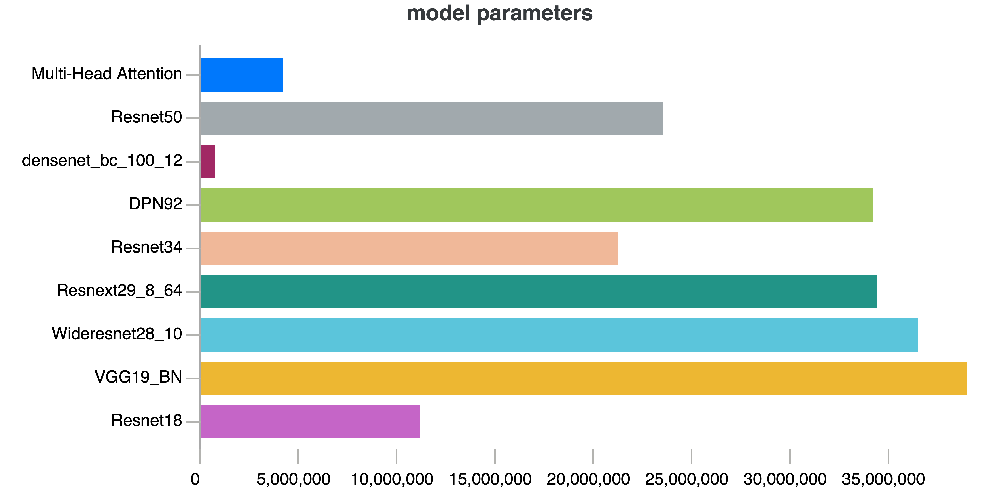

# E2E-Keyword-Spotting

Joint End to End Approaches to Improving Far-field Wake-up Keyword Detection

## :wrench: Dependencies and Installation

- Python >= 3.7 (Recommend to use [Anaconda](https://www.anaconda.com/download/#linux) or [Miniconda](https://docs.conda.io/en/latest/miniconda.html))
- [PyTorch >= 1.3](https://pytorch.org/)
- NVIDIA GPU + [CUDA](https://developer.nvidia.com/cuda-downloads)


1. Install dependent packages

    ```bash
    cd E2E-Keyword-Spotting
    pip install -r requirements.txt
    ```
2. Or use conda 
    ```bash
    cd E2E-Keyword-Spotting
    conda env create -f environment.yaml
    ```

## :turtle: Dataset Preparation

#### How to Use
Dataset is from [Google Speech Command](./basicsr/data/paired_image_dataset.py) 
* Data Pre-processing (Has already been done)
1. According to the file, dataset has already been splited into three folders, train, test, and valid. 
1. The splited [Google Speech Command dataset](https://drive.google.com/file/d/1InqR8n7l5Qj6voJREpcjHYWHVTKG-BbB/view?usp=sharing) is saved on Google Drive folder. 
    
## :computer: Train and Test
### Training commands
- **Single GPU Training**: 
```
python train.py
```
- **Distributed Training**: 
```
CUDA_VISIBLE_DEVICES=0,1 python train.py
```
### Test commands
```
python test.py 
```
## Neural Network Architectures  
1. Multi-head Attention
* Encoder: GRU/LSM 
* Attention Heads: 8
* GRU hidden nodes: 128/256/512
* GRU layers: 1/2/3
* Increasing GRU hidden layers nodes can increase the performance much better than increasing hidden layers 

2. VGG-19 with batch normalization
3. Deep Residual Neural Network ('resnet18', 'resnet34', 'resnet50') 
4. Wide Residual Networks ('wideresnet28_10') imported from the [repository](https://github.com/xternalz/WideResNet-pytorch/blob/master/wideresnet.py)
5. Dual Path Networks from [arxiv](https://arxiv.org/abs/1707.01629) imported from [repository](https://github.com/kuangliu/pytorch-cifar/blob/master/models/dpn.py)
6. Densely Connected Convolutional Networks from [arxiv](https://arxiv.org/abs/1608.06993) imported from [repository](https://github.com/bearpaw/pytorch-classification/blob/master/models/cifar/densenet.py)

## Result

Result can be viewed on [wandb](https://wandb.ai/bozliu/google_speech_command?workspace=user-bozliu)

### Model Parameters 


### Best Accuracy Training Process


### Best Loss Training Process


## Files Description
├── kws
│   ├── metrics
│   │   ├── fnr_fpr.py
│   │   ├── __init__.py
│   ├── models
│   │   ├── attention.py
│   │   ├── crnn.py
│   │   ├── densenet.py
│   │   ├── dpn.py
│   │   ├── __init__.py
│   │   ├── resnet.py
│   │   ├── resnext.py
│   │   ├── treasure_net.py
│   │   ├── vgg.py
│   │   └── wideresnet.py
│   ├── transforms
│   ├── utils.py
├── config.py

   

* *./kws/metrics* : Evaluation matrics, defining the False Rejection Rate (FRR) and False Alarm Rate (FAR) for keyword spotting
* *./kws/models* : Diffferent network architecture 
* *.config.py* : Configuration about parameters and hyperparameters
