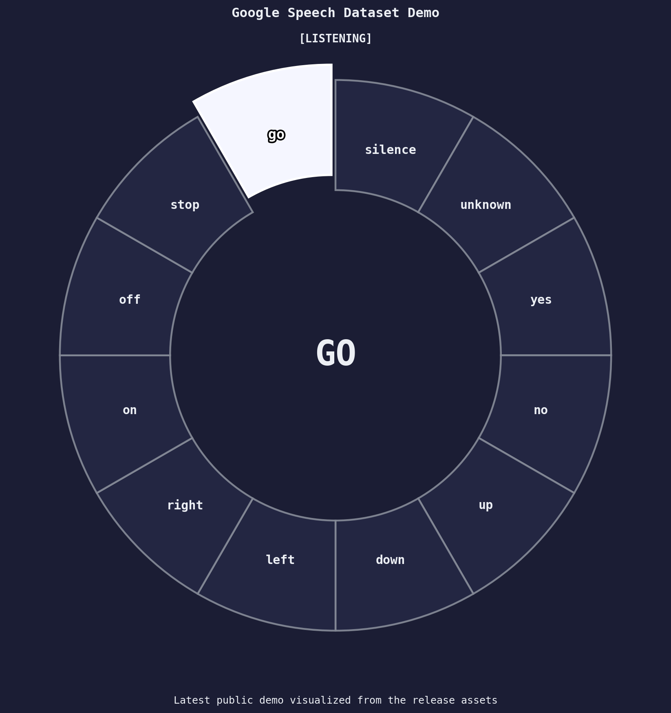
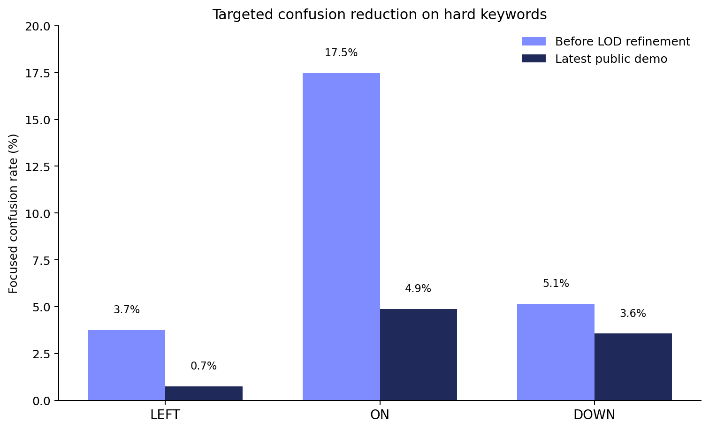
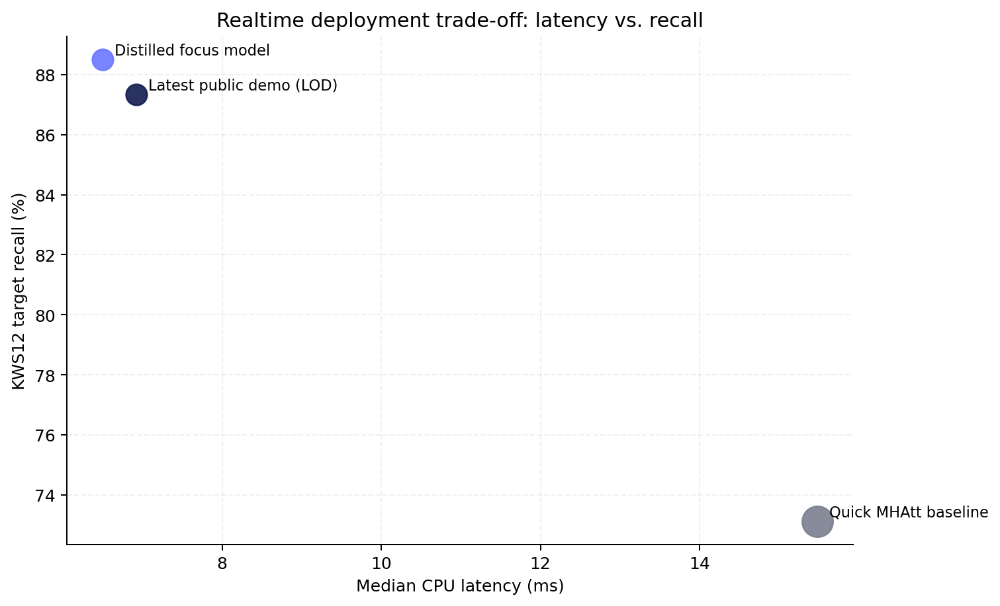

# End-to-End Keyword Spotting (`v2` Public Release)

A cleaned public release of a lightweight end-to-end keyword spotting (KWS) system for realtime command recognition and wake-oriented far-field screening.

## Overview
This repository packages the current public `v2` version of the project into a reproducible research-and-engineering artifact. It keeps the original thesis-era implementation available in `legacy-v1`, while `main` is intended to track the latest stable public release.

The public `v2` pipeline combines:
- a lightweight `mhatt_crnn` or `keyword_mamba` backbone,
- dual-task learning for `command31` classification and wake/no-wake detection,
- teacher distillation from `WavLM Base+` during training only,
- confusion-aware keyword-focus training for hard pairs such as `left / on / down`, and
- a realtime Matplotlib demo with automatic checkpoint/device ranking.

## Why Keyword Spotting Matters
Keyword spotting is a core building block for on-device voice interfaces, smart speakers, wearables, and embedded assistants. A practical KWS system has to be accurate enough for daily use, lightweight enough to stay resident, low-latency enough to feel instantaneous, and robust enough to tolerate noise, distance, and speaker variation. This repository focuses on that deployment-facing regime rather than accuracy alone.

## What Changed from the Legacy Repository
Compared with the legacy public branch, this release adds:
- a modern Python 3.12 / PyTorch 2.5 codebase under `src/`,
- unified training, evaluation, ranking, and demo CLIs,
- lightweight distilled checkpoints selected by realtime deployment criteria,
- targeted confusion reduction for hard command pairs,
- public dataset setup instructions instead of redistributing datasets,
- benchmark figures and reusable tables, and
- CI smoke checks for the public release branch.

The old version remains available in the `legacy-v1` branch and the `v1.0-legacy` tag.

## Main Contributions
1. A public, reproducible end-to-end KWS pipeline for `Speech Commands`-style command recognition with wake-centric evaluation.
2. A lightweight distilled demo model that preserves CPU-friendly latency while improving hard-keyword robustness.
3. A keyword-focus training/calibration workflow that explicitly targets confusable command pairs instead of optimizing only a single aggregate score.
4. A practical realtime demo interface and ranking flow that can be reused by others for low-latency KWS benchmarking.

## Project Task and Deployment Goal
The public `v2` task is a `12`-label deployment-oriented KWS setup:
- `silence`
- `unknown`
- `10` target command keywords: `yes, no, up, down, left, right, on, off, stop, go`

The deployment goal is not open-vocabulary ASR. It is a lightweight always-on command recognizer with low CPU latency, reduced false triggers, and better handling of hard confusions in interactive demo settings.

## What Is Unique in This Release
Relative to the legacy repo and to standard small-footprint KWS baselines, the public `v2` release emphasizes a specific engineering combination:
- **dual-task supervision**: command recognition plus wake screening from a shared backbone,
- **training-only heavy teacher**: `WavLM Base+` is used only during training, not at runtime,
- **confusion-aware optimization**: difficult words can receive higher weights and explicit separation pressure,
- **targeted runtime calibration**: hard keywords use stronger per-keyword guardrails without slowing the whole vocabulary, and
- **deployment-first model selection**: ranking uses latency and false-trigger guardrails rather than accuracy only.

This means the repository is not claiming a universal new SOTA result. Instead, it offers a strong, transparent, and reusable public baseline for realtime lightweight KWS.

## Repository Layout
```text
.
├── README.md
├── LICENSE
├── CHANGELOG.md
├── pyproject.toml
├── environment.yml
├── configs/
├── scripts/
├── src/
├── tests/
├── assets/
│   ├── benchmarks/
│   ├── demo/
│   └── figures/
├── checkpoints/
└── data/
```

## Installation
### Conda
```bash
bash scripts/bootstrap_env.sh
conda activate dl
```

To use a different environment name:
```bash
KWS_ENV_NAME=my-kws-env bash scripts/bootstrap_env.sh
conda activate my-kws-env
```

### Editable install
```bash
python -m pip install -e .
```

## Datasets
This repository does **not** redistribute dataset audio.

### Public dataset sources
- Google Speech Commands (official paper): [1]
- HI-MIA far-field speaker verification data: [2]

The public setup instructions live in [data/README.md](data/README.md).

### Prepare Speech Commands split
```bash
python scripts/prepare_speech_commands.py \
  --dataset-root /path/to/speech_commands_v0.02 \
  --output-root data/local/speech_commands_split \
  --mode symlink
```

### Download HI-MIA manifests and audio
```bash
bash scripts/download_hi_mia.sh
```

## Training
### Latest public demo recipe
```bash
python -m kws.train --config configs/demo_mhatt_small_focus_lod.yaml
```

### Quick internal baseline
```bash
python -m kws.train --config configs/quick_mhatt.yaml
```

### Batch demo training helpers
```bash
bash scripts/run_demo_training.sh
bash scripts/run_quick.sh
bash scripts/run_smoke.sh
```

## Evaluation
```bash
python -m kws.eval \
  --checkpoint checkpoints/demo_mhatt_small_focus_lod_best_kws12.pt \
  --split test
```

## Realtime Demo
### Explicit checkpoint path
```bash
python -m kws.demo.realtime \
  --checkpoint checkpoints/demo_mhatt_small_focus_lod_best_kws12.pt \
  --device auto \
  --wheel kws12 \
  --audio-device 1
```

### Enable `--checkpoint auto`
```bash
bash scripts/install_public_checkpoints.sh
python scripts/select_demo_checkpoint.py
python -m kws.demo.realtime --checkpoint auto --device auto --wheel kws12 --audio-device 1
```

## Public Checkpoints
Release weights are documented in [checkpoints/README.md](checkpoints/README.md). They are distributed through GitHub Releases rather than Git history.

## Results
### Demo Figure


This figure shows the public realtime interface used for the demo benchmark. The center label presents the current predicted command, while the highlighted wheel segment gives fast feedback for streaming inference. This is useful to other practitioners because it demonstrates how a low-latency KWS system can be exposed interactively instead of only through offline accuracy numbers. The figure can be regenerated with:

```bash
PYTHONPATH=src python scripts/build_public_assets.py
```

### Demo-Centric Benchmark Table
| Model / Run | Runtime Device | Params | Latency (ms) | `kws12_target_recall` | `unknown_to_target_rate` | `focus_keyword_recall_mean` | `focus_pair_confusion_rate` | Notes |
| --- | --- | ---: | ---: | ---: | ---: | ---: | ---: | --- |
| `quick_mhatt` | CPU | 1.73 M | 15.48 | 0.7312 | 0.0630 | 0.7878* | n/a | Internal lightweight baseline before distillation and keyword-focus refinement |
| `demo_mhatt_small_focus` | CPU | 0.81 M | 6.50 | 0.8851 | 0.0267 | 0.8582 | 0.0862 | Distilled lightweight model with keyword-focus weighting and runtime calibration |
| `demo_mhatt_small_focus_lod` | CPU | 0.81 M | 6.92 | 0.8734 | 0.0548 | 0.9303 | 0.0300 | Latest public demo checkpoint optimized for `left / on / down` confusions |

`*` Recomputed from per-keyword recall for `left`, `on`, and `down` because the earliest baseline report did not yet expose the newer focus-pair metric directly.

This table is the main deployment summary for the public release. It shows that the latest public demo was not chosen by raw aggregate accuracy alone; it was chosen because it keeps single-digit CPU latency while sharply reducing the hard confusions that dominated the interactive demo. Others can reuse this table as a transparent comparison point when evaluating their own lightweight KWS checkpoints under a similar deployment-first lens. The raw public benchmark data used to build this table lives in [`assets/benchmarks/demo_benchmark.csv`](assets/benchmarks/demo_benchmark.csv).

### Focused Confusion Reduction on Hard Keywords


This figure compares the confusion rate on the three explicitly targeted hard keywords: `left`, `on`, and `down`. It is helpful because it highlights a failure mode that aggregate accuracy can hide: a model may score well overall while still confusing phonetically difficult commands in realtime use. Researchers can reuse this figure to evaluate targeted refinements, curriculum changes, or calibration strategies on their own checkpoints. The chart is generated from [`assets/benchmarks/focus_confusions.csv`](assets/benchmarks/focus_confusions.csv).

### Latency vs. Recall Trade-off


This figure visualizes the deployment trade-off between CPU latency and target-keyword recall across the public benchmark candidates. It is useful because embedded and always-on systems rarely optimize a single metric in isolation; this view makes the cost/benefit of each checkpoint legible. Others can reuse it as a template for model selection when latency, recall, and false-trigger behavior all matter. The source data is stored in [`assets/benchmarks/demo_benchmark.csv`](assets/benchmarks/demo_benchmark.csv).

### Legacy Public Repo vs. Public `v2`
| Release | Public scope | Realtime demo | Reproducible dataset setup | Public benchmark assets | Notes |
| --- | --- | --- | --- | --- | --- |
| `legacy-v1` | Thesis-era public baseline | No shipped public demo workflow | No official split helper; pre-split data link in old README | Training curves only | Preserved for historical continuity |
| `v2.0-public` | Latest stable public release | Yes | Yes, with public download instructions and `prepare_speech_commands.py` | Yes, with CSV-backed figures and tables | Intended public reference version on `main` |

This release-comparison table is intentionally qualitative rather than over-claimed. The old public repo did not ship a directly reproducible checkpoint-and-demo benchmark under the current protocol, so the fairest comparison is about public usability and reproducibility. That distinction matters for others because a research repository is only reusable if outsiders can install it, prepare data, and run the reported pipeline without hidden local state.

### Selected Literature Context
| Method | Dataset / Protocol | Headline Metric | Value | Source Type | Comparability |
| --- | --- | --- | ---: | --- | --- |
| Public `v2` release (ours) | Speech Commands V1 12-label task + HI-MIA negatives | `kws12_target_recall / latency` | `87.34% / 6.92 ms` | Reproduced in this repo | Not directly comparable |
| MatchboxNet-3x2x64 [4] | Speech Commands V2 12-class | Accuracy | `98.19%` | Reported from paper | Close but not exact |
| BC-ResNet [5] | Speech Commands V2 12-class | Accuracy | `98.0%` | Reported from paper | Close but not exact |

This table is included for context, not for inflated claims. The public `v2` release uses a different data mix and deployment-oriented selection criteria, so we intentionally describe it as **competitive and practically useful**, not as a directly proven new SOTA. That framing helps other readers compare methods responsibly instead of treating incomparable numbers as if they were measured under one protocol.

## What These Results Mean in Practice
The public benchmark artifacts are designed to be reusable, not decorative.

- The **demo benchmark table** helps others choose a checkpoint for latency-constrained CPU deployment.
- The **focused confusion figure** helps diagnose whether a model is failing on a few phonetically difficult commands.
- The **latency vs. recall figure** helps compare deployment trade-offs across checkpoints without rerunning the full demo by hand.
- The **CSV files in `assets/benchmarks/`** make it straightforward to plug the same visualizations into papers, lab notebooks, or CI dashboards.

## Reproducibility Notes
- Python: `3.12`
- Runtime stack: `torch>=2.5`, `torchaudio>=2.5`
- Public environment file: [`environment.yml`](environment.yml)
- Package metadata: [`pyproject.toml`](pyproject.toml)
- Public release workflow: [`docs/public-release.md`](docs/public-release.md)

The recommended public demo config is [`configs/demo_mhatt_small_focus_lod.yaml`](configs/demo_mhatt_small_focus_lod.yaml). It uses:
- `mhatt_crnn`
- `80` mel bins at `16 kHz`
- `1.0 s` audio windows
- training-time `WavLM Base+` teacher distillation
- keyword-focus weighting and confusion-aware loss for hard pairs

## Limitations
- The realtime demo remains sensitive to microphone quality, room acoustics, and speaking style.
- Literature comparisons in this README are context-only unless the dataset, preprocessing, label space, and evaluation protocol match exactly.
- Public checkpoint selection is deployment-oriented, so the chosen demo model is not necessarily the one with the best single offline metric.
- HI-MIA is used as an auxiliary public far-field source, which makes the final operating point different from a pure Speech Commands benchmark.

## Public Release Process
The recommended branch/PR/release workflow is documented in [`docs/public-release.md`](docs/public-release.md). In short:
- keep `main` for the latest cleaned public release,
- preserve the old repository in `legacy-v1`,
- prepare changes in `codex/update-final-public-release`,
- require a PR and CI before merging, and
- distribute checkpoints through GitHub Releases.

## Changelog
See [`CHANGELOG.md`](CHANGELOG.md).

## References
[1] P. Warden, “Speech Commands: A Dataset for Limited-Vocabulary Speech Recognition,” arXiv:1804.03209, 2018.

[2] X. Qin, N. Li, H. Li, S. Bu, X. Wu, X. Li, H. Liu, and H. Meng, “HI-MIA: A Far-Field Text-Dependent Speaker Verification Database and the Baselines,” arXiv:1912.01231, 2019.

[3] T. N. Sainath and C. Parada, “Convolutional Neural Networks for Small-footprint Keyword Spotting,” in *Proc. Interspeech*, 2015, pp. 1478-1482.

[4] S. Majumdar and B. Ginsburg, “MatchboxNet: 1D Time-Channel Separable Convolutional Neural Network Architecture for Speech Commands Recognition,” arXiv:2004.08531, 2020.

[5] S. Y. Lee, Y. Han, and S. Choi, “Broadcasted Residual Learning for Efficient Keyword Spotting,” arXiv:2106.04140, 2021.

[6] S. Chen, C. Wang, Z. Chen, Y. Wu, S. Liu, J. Li, N. Qian, M. Zeng, X. Yu, F. Wei, and Y. Wu, “WavLM: Large-Scale Self-Supervised Pre-Training for Full Stack Speech Processing,” arXiv:2110.13900, 2021.
