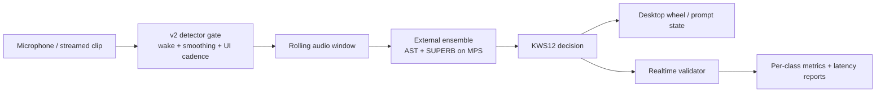
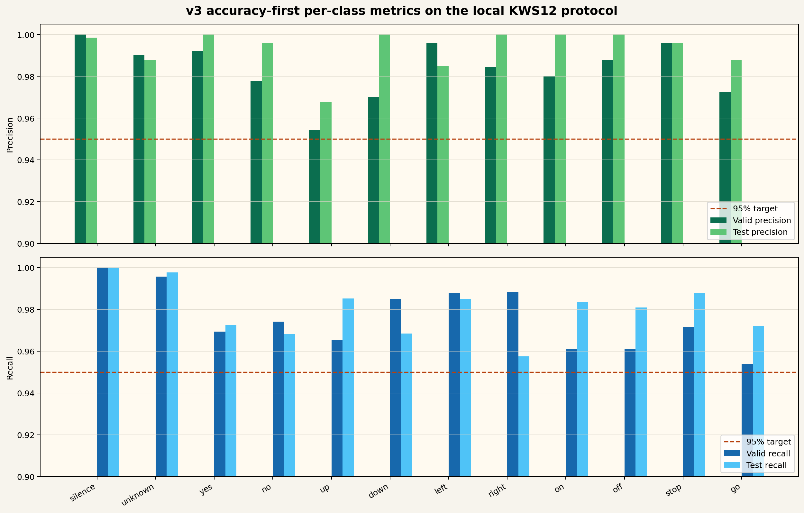
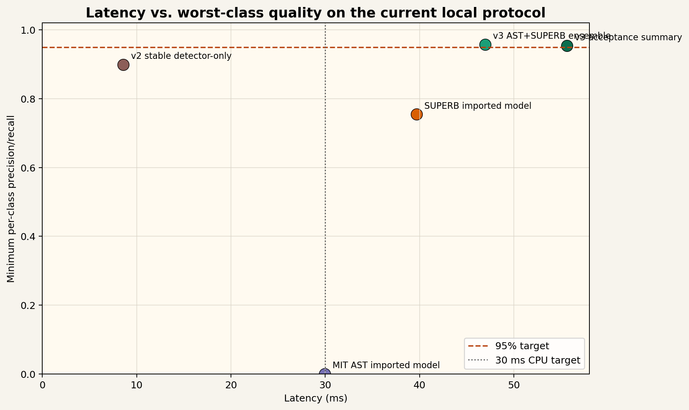
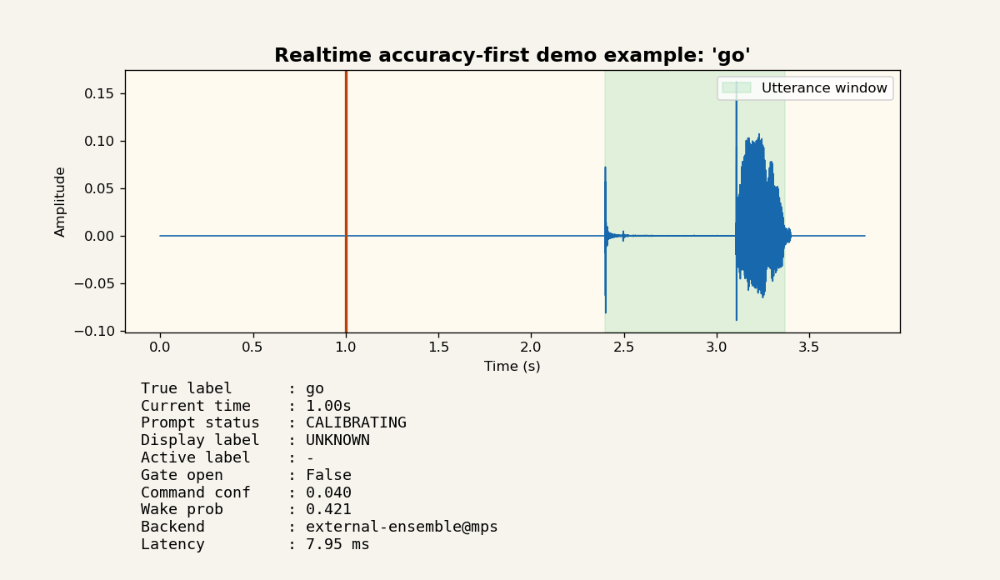

# E2E Keyword Spotting v3

`v3` is the current public release of this repository: a release-focused rebuild of the older end-to-end keyword spotting project, now organized around reproducible benchmarks, a CPU-safe baseline demo, and an `accuracy-first` desktop demo that uses an imported Hugging Face ensemble on Apple MPS.

The short version:

- `v2` is still the practical CPU desktop baseline.
- `v3` is the strongest local-protocol accuracy path we have today.
- On the current local `KWS12` protocol, `v3` passes the offline `valid/test` target of `min per-class precision >= 95%` and `min per-class recall >= 95%`.
- Full-stream realtime validation must still be rerun before we headline realtime `>95%` as a public claim. At the moment, the realtime path is smoke-validated and the offline benchmark is the formal result.

## What is public in this repo

- `v2 detector-only CPU demo`
  - stable, lightweight, public-safe baseline
- `v3 accuracy-first desktop demo`
  - detector gate + external `AST + SUPERB` ensemble
  - requires Apple `MPS`
- `Hosted browser demo`
  - free Hugging Face Space with browser mic + CPU inference
  - convenience/public access path only, separate from the local `accuracy-first` MPS demo

## Release Status

| Claim | Current status | Evidence |
| --- | --- | --- |
| `v3` offline local-protocol benchmark passes `95%+` per class | Passed | [`docs/assets/data/release_summary_v3.json`](docs/assets/data/release_summary_v3.json) |
| `v3` desktop realtime path exists and shares the same runtime engine as the validator | Implemented | [`src/kws/demo/realtime.py`](src/kws/demo/realtime.py), [`src/kws/demo/validate_realtime.py`](src/kws/demo/validate_realtime.py) |
| Full realtime `valid/test` claim is ready for public headline use | Not yet locked | Long validator commands are listed below |

This table is intentionally conservative. It separates what is already proven from what still needs one last long validation run.

## v1 -> v2 -> v3

| Version | Core stack | Primary demo mode | Training / release setup | Eval protocol | Min per-class precision | Min per-class recall | Unknown->target rate | Latency | Status |
| --- | --- | --- | --- | --- | ---: | ---: | ---: | ---: | --- |
| `v1 (2021 legacy)` | archived end-to-end KWS prototype | historical local script | legacy codebase, not reproduced in this repo | not rebenchmarked | `-` | `-` | `-` | `-` | Historical reference only |
| `v2 (branch + v2.0.0 tag)` | `MHAtt-CRNN` detector-only | CPU desktop demo | Speech Commands + HI-MIA negatives, stable selection profile | current local protocol, selection validation | `90.47%` | `89.91%` | `2.67%` | `8.57 ms` CPU | Public-safe CPU baseline |
| `v3 (main / v3.0.0)` | detector gate + `AST/SUPERB` external ensemble | accuracy-first desktop demo on `MPS` | imported HF verifier/teacher + realtime validator + public-release assets | full `valid/test` local command-label protocol | `95.44%` | `95.38%` | `0.43%` | `55.64 ms` MPS | Offline acceptance passed |

What this means:

- `v2` is still the better choice when you need a fast CPU-only demo.
- `v3` is the first path in this repo that clears the worst-class `95%` target on the current local protocol.
- `v3` achieves that by trading latency for accuracy and by relying on `MPS`, so it should be presented as an `accuracy-first` mode, not a universal default for all machines.

## System Overview


```mermaid
flowchart LR
    Mic["Microphone / streamed clip"] --> Gate["v2 detector gate<br/>wake + smoothing + UI cadence"]
    Gate --> Buffer["Rolling audio window"]
    Buffer --> Ensemble["External ensemble<br/>AST + SUPERB on MPS"]
    Ensemble --> Decision["KWS12 decision"]
    Decision --> GUI["Desktop wheel / prompt state"]
    Decision --> Validator["Realtime validator"]
    Validator --> Reports["Per-class metrics + latency reports"]
```

This diagram shows why `v3` is not just “one bigger model.” The detector is still useful for gate behavior and realtime UX, while the imported ensemble is the high-accuracy label source.

## Visual Results



This figure shows `precision` and `recall` for every `KWS12` class on both `valid` and `test`. The dashed `95%` line is the acceptance target. This is a good result: every bar for the offline `v3` benchmark stays above the target line, including the historically weaker words like `up`, `go`, and `right`.



This figure shows the tradeoff that matters for release positioning. `v2` is much faster on CPU, but it does not clear the worst-class `95%` target. `v3` moves to the right because it uses an external ensemble on `MPS`, but it is the first configuration that reaches the quality target on this local protocol.



This GIF is a real streamed inference example, rendered from the same `RealtimeEngine` that powers the desktop validator. It is a good public-facing visualization because it shows the utterance window, the emitted label, the gate state, and the runtime latency all in one place. The clip metadata is tracked in [`docs/assets/data/realtime_demo_clip.json`](docs/assets/data/realtime_demo_clip.json).

## Benchmark vs Ourselves

| Method | Split / protocol | Metric scope | Min precision | Min recall | Unknown->target rate | Latency | Device |
| --- | --- | --- | ---: | ---: | ---: | ---: | --- |
| `v2 stable detector-only` | selection validation | min per-class precision / recall | `90.47%` | `89.91%` | `2.67%` | `8.57 ms` | `cpu` |
| `SUPERB imported model` | test | min per-class precision / recall | `75.47%` | `94.27%` | `4.83%` | `39.69 ms` | `mps` |
| `MIT AST imported model` | test | min per-class precision / recall | `0.00%` | `0.00%` | `0.33%` | `29.96 ms` | `mps` |
| `v3 AST+SUPERB ensemble` | test | min per-class precision / recall | `96.75%` | `95.75%` | `0.21%` | `46.95 ms` | `mps` |
| `v3 acceptance summary` | valid + test | goal pass snapshot | `95.44%` | `95.38%` | `0.43%` | `55.64 ms` | `mps` |

This is the most important comparison in the README. It shows that imported large models are not automatically good on our protocol: `SUPERB` alone is recall-heavy but too noisy, and `MIT AST` alone is unusable here. The useful improvement is the final `AST+SUPERB` ensemble plus the runtime packaging around it.

## Reference vs SOTA

| Method | Dataset / protocol | Headline metric | Value | Source type | Comparability |
| --- | --- | --- | --- | --- | --- |
| `Ours v3 accuracy-first` | current local command-label protocol (`valid + test`) | min per-class precision / recall | `95.44% / 95.38%` | Reproduced in this repo | Directly comparable only inside this repo |
| `Ours v2 stable detector-only` | current local protocol, selection validation | min per-class precision / recall | `90.47% / 89.91%` | Reproduced in this repo | Directly comparable only inside this repo |
| `MatchboxNet-3x2x64` | Speech Commands V2 12-class closed-set classification | Accuracy | `98.19%` | Reported in prior paper benchmarks | Not directly comparable |
| `BC-ResNet` | Speech Commands V2 12-class closed-set classification | Accuracy | `98.0%` | Reported in prior paper benchmarks | Not directly comparable |
| `EdgeSpot (ICASSP 2026)` | few-shot KWS at fixed FAR | `10-shot accuracy @ 1% FAR` | `82.0%` | Reported in paper abstract | Not directly comparable |

This table is useful only if the comparability column is taken seriously. Our current public claim is about our own local protocol and runtime packaging. The paper baselines above are important context, but they are not a fair apples-to-apples ranking against the `v3` result shown here.

## Realtime Demo

### `v3` accuracy-first desktop demo

```bash
conda run -n dl python -m kws.demo.realtime \
  --demo-profile accuracy-first \
  --checkpoint auto \
  --device mps \
  --external-kws-device mps \
  --wheel kws12 \
  --audio-device 1
```

### `v2` CPU baseline desktop demo

```bash
conda run -n dl python -m kws.demo.realtime \
  --demo-profile cpu-baseline \
  --checkpoint auto \
  --device cpu \
  --wheel kws12 \
  --audio-device 1
```

### Full realtime validation gate

Run these before turning realtime into a public headline claim:

```bash
conda run -n dl python -m kws.demo.validate_realtime \
  --demo-profile accuracy-first \
  --checkpoint auto \
  --device mps \
  --external-kws-device mps \
  --wheel kws12 \
  --split valid \
  --output reports/realtime_accuracy_first_valid.json
```

```bash
conda run -n dl python -m kws.demo.validate_realtime \
  --demo-profile accuracy-first \
  --checkpoint auto \
  --device mps \
  --external-kws-device mps \
  --wheel kws12 \
  --split test \
  --output reports/realtime_accuracy_first_test.json
```

Current public interpretation:

- The realtime path is implemented and smoke-validated.
- The offline benchmark is the formal `95%+` result today.
- Once both long realtime reports pass, this README can be updated to promote realtime from “smoke validated” to “fully validated on the local protocol.”

## Public Demo And Release Assets

- GitHub repo: [bozliu/E2E-Keyword-Spotting](https://github.com/bozliu/E2E-Keyword-Spotting)
- Hugging Face Space demo: [bozliu/e2e-keyword-spotting-demo](https://huggingface.co/spaces/bozliu/e2e-keyword-spotting-demo)
- Public release process: [`docs/public_release_v3.md`](docs/public_release_v3.md)
- Browser demo checklist: [`docs/public_demo_release_checklist.md`](docs/public_demo_release_checklist.md)

Recommended hosting split:

- GitHub: source code, figures, cleaned metrics, release notes, demo GIF/MP4
- GitHub Releases: our own checkpoints and calibration files
- Hugging Face model repo: model card + our release artifacts
- Hugging Face Space: free CPU/browser demo for public mic testing, kept clearly separate from the local `MPS` flagship path

Version navigation:

- `legacy-v1` keeps the 2021 historical line browseable.
- `v2` is the read-only archive branch for the former `main`, with `v2.0.0` as the canonical frozen snapshot.
- `main` is the current `v3` public line, tagged at `v3.0.0`.

Do not upload raw Speech Commands or HI-MIA audio.

## Reproducing The Benchmark

### Environment

```bash
conda activate dl
bash scripts/bootstrap_env.sh
```

### Offline external-model benchmark

```bash
conda run -n dl python -m kws.benchmark_external \
  --model-id ensemble/ast-superb-kws12 \
  --device mps \
  --split valid \
  --output reports/benchmark_ensemble_ast_superb_kws12_valid.json
```

```bash
conda run -n dl python -m kws.benchmark_external \
  --model-id ensemble/ast-superb-kws12 \
  --device mps \
  --split test \
  --output reports/benchmark_ensemble_ast_superb_kws12_test.json
```

### Generate public figures and cleaned summaries

```bash
conda run -n dl python scripts/generate_release_assets.py
```

### Render a release GIF from the realtime engine

```bash
conda run -n dl python scripts/render_release_demo_gif.py \
  --label go \
  --split test \
  --checkpoint auto \
  --device mps \
  --external-kws-device mps
```

### Run the local release gate

```bash
bash scripts/prepare_release_v3.sh
```

```bash
KWS_RELEASE_RUN_LONG_VALIDATION=1 bash scripts/prepare_release_v3.sh
```

## Repository Layout

```text
.
├── README.md
├── app.py
├── configs/
├── docs/
├── scripts/
├── src/kws/
└── tests/
```

The tracked repository is intentionally code-and-release-assets only. Local data, checkpoints, caches, and raw experiment outputs should stay out of git.

## Limitations

- `v3` is the best current local-protocol accuracy path, not the best all-around deployment path.
- `v3` depends on Apple `MPS` for its best result; the CPU baseline is still `v2`.
- HI-MIA full restore is still useful for future work, but it is not the blocker for the current local-protocol release claim.
- Paper SOTA rows use different datasets, protocols, and operating points, so they are context, not a fair leaderboard.
